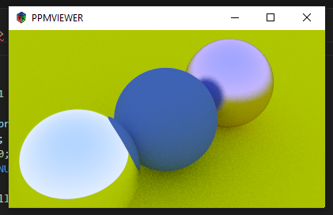
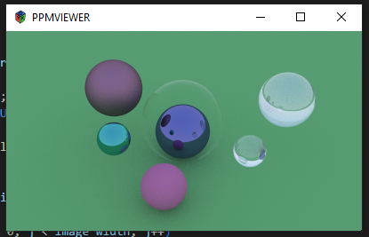

### PPM File Viewer

I coded this to help me view ppm files while following the book Ray Tracing in One Weekend, i recommend put the .exe in the same directory as the ppm file output 😉.

### Dependencies

- GTK Widgets 3.0
- Cairo

### Install

```
git clone https://github.com/burningbuffer/ppmviewer.git

cd ppmviewer

make build
```

### Run

```
./ppmviewer <your-ppm-file.ppm>
```
### Examples





